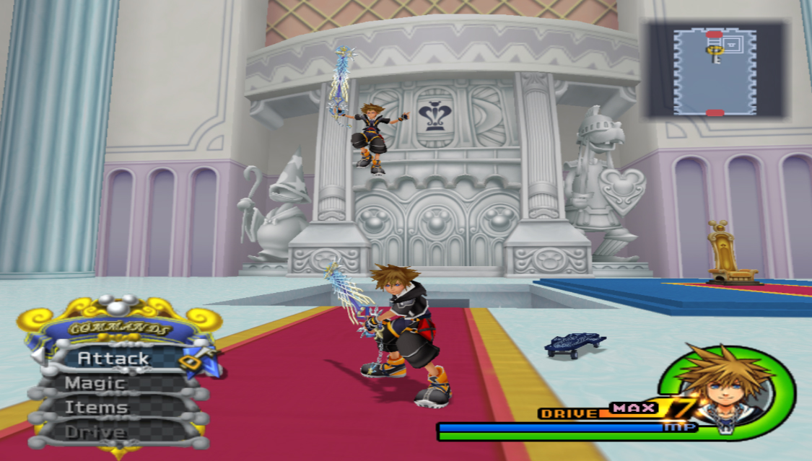
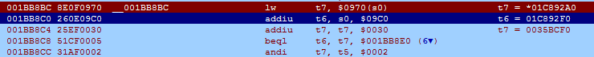
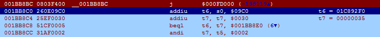
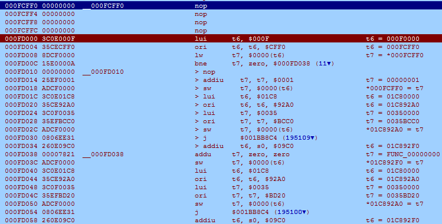

## About

This is a multiplayer hack for the PAL version of Kingdom Hearts II (KH2). It allows 2 playable* characters to be controlled by separate controllers. You can find the code and installation instructions over at [KH-Vids](https://kh-vids.net/threads/kingdom-hearts-ii-multiplayer-hack.154198/).

_\* Playable meaning any character than can be controlled during the game **except** for Riku._



The purpose of this post is to give some background on the hack and perhaps provide some insight for anyone else looking to get into more advanced hacking for PS2 games. You can safely ignore this post if you're only looking for the codes.

## Origin

One of the things I had always wondered was why Kingdom Hearts had no multiplayer component. I looked around various threads for codes that would allow a second player to control one of the party members but alas, no luck. "Hey, I'm a programmer so why not make it myself?" I thought. And with that, the project was born.

One approach to creating hacks is to manipulate a game's memory. These types of hacks are generally ones that change an in-game value such as money or health. Programs such as Cheat Engine and ArtMoney allow you to observe and change values in memory quite easily so I decided to start there.

Around the end of 2014, I downloaded Cheat Engine and started on my quest to multiplayer glory. I spent hours and days just changing and freezing values in memory to see if I could figure something out but without any idea of the game's underlying architecture, this quickly became a dead end. It turns out implementing multiplayer for a game with no available source code is not a small feat! I would continue to work on this (in the same aimless fashion) occasionally for the next year or so.

Let's fast forward to mid-2016 to when I first started freelancing. At this point, I hadn't actually done any professional programming work so gigs were hard to come by. Luckily, I landed a very small job making cheat codes for an NES game. It was here that I first experienced the ~~horror~~ beauty of an assembly language.

The NES uses the [6502](http://www.6502.org/tutorials/6502opcodes.html) instruction set as its language which is simple to learn as there aren't too many instructions. Coupling that with three registers and 2KB of RAM lead to easy reverse engineering because you only had to comb through a very small amount of data.

Working with assembly lead me to ask an important question regarding the multiplayer hack: what if I could make a game execute _custom_ code? I already knew the memory manipulation approach wasn't working so perhaps this was the way forward.

## Breaking the Code



_I worked on this hack on and off over a 1.5 year period. As a result, there is a lot I don't remember regarding the steps I took or how I reached a certain conclusion._

_Another thing to note is that I will be referencing MIPS assembly instructions. [Here](http://www.mrc.uidaho.edu/mrc/people/jff/digital/MIPSir.html) is an instruction reference if you don't understand them._

Before I get into how I did it, I'd like to mention one tool that helped tremendously in achieving this hack. That tool is [PCSX2dis](http://forums.pcsx2.net/Thread-PCSX2dis-v1-1-A-ps2dis-inspired-PCSX2-enabled-Game-Hacking-Tool-W-I-P-13-02-2015) (created by LXShadow) which is a combination of the [PCSX2](https://pcsx2.net/) emulator and the [PS2dis](http://www.geocities.ws/SiliconValley/Station/8269/ps2dis/index.html) disassembler (created by Hanimar). PCSX2dis features a real-time view of the game's memory and more importantly, it allows you to change memory values at runtime. The other great feature is the ability to pause execution using breakpoints. This is very handy as it allows you to see a register's value at that point in time. I would highly recommend using PCSX2dis if you are getting into hacking PS2 games.

With that out of the way, let's get started!

### First Steps

At this point in my journey, I had already done two things. The first was hacking NES games which taught me that games will store the controller state somewhere in memory. The second was creating a few small games in Java which taught me about the update loop. This also taught me that a game will (usually) poll for controller inputs every frame.

With this knowledge, I reasoned that there should be a pointer that points to the state of the first controller. And if I change the pointer so that it points to the state of the second controller instead, the second controller should start working (but with the first controller disabled obviously). So, my first step was to find both of these addresses. By the way, in the PS2 hacking scene, these controller addresses are called **jokers** (don't ask me why).

Fortunately for me, the PS2's operating system stores controller states even if the game doesn't use them which meant I could plug in a second controller, press some buttons and use Cheat Engine to find any addresses that changed values. Unfortunately for me, there were quite a lot of addresses that could have been the correct jokers. Two of the addresses I ended up with were **0035BA5C** for controller 1 and **0035BBDC** for controller 2. Unfortunately, there wasn't a way for me to know if these were the correct jokers so I decided to abandon this particular route.

### Breakthroughs

_Unfortunately, I don't remember the next few steps I took so details are a little vague._

At some point, after jumping in and out of functions, and reading a lot of register values, I somehow managed to find a pointer leading to this address: **01C892A0**. What was intriguing about this address was that it contained a pointer leading to **0035BCC0**. Hang on, this address looks pretty close to the controller 1 joker I found earlier! Perhaps this was the correct joker (it was). I decided to see if I could find a similar address for controller 2 and somehow ended up with **0035BD20**.

One of the cool things about PCSX2 is that you can freeze specified parts of memory by creating cheat codes so I decided to make a cheat code to replace the pointer at **01C892A0** (which was **0035BCC0**) with **0035BD20**. Lo and behold, the playable character was now controlled by the second controller instead of the first! Now that I knew it was possible to use the second controller, my next step was to figure out how to have two separately controlled characters. Adding two playable characters would be easy since there was already a cheat code for it but assigning the correct controllers would be trickier.

In Kingdom Hearts, you only ever control one character so I decided to see what would happen if I changed the party to contain two playable characters. It turned out that both characters will respond to the first controller. This meant there had to be at least one function that executed for each playable character otherwise one character would not work.

To find this function, I put a read breakpoint on **01C892A0**, which was the address that held the pointer to controller 1's joker. Every time it broke, I replaced the code that called it with nothing and then continued the game, checking to see if running, jumping, attacking or guarding became disabled. In this case, zeroing out **001BB8BC** caused movement to stop working so I knew I was in the function for movement. This address would be where I jump to my own function.



### Executing Custom Functions

The custom function would simply ping-pong between jokers every time the movement function executes. But to store custom code, I needed an area of memory that the game wasn't using. Luckily, the area around **000FD000** seemed to be unoccupied so I decided to put my code there.

To jump to my custom function, I replaced:

```
lw t7, $0970(s0)
```

With:

```
j $000FD000
```



One thing to note is that when the game reaches a branch or jump instruction, the line _after_ the branch/jump is executed _first_. This line is called the delay slot.

As you can see in the image above, there is an instruction in the delay slot (blue line):

```
addiu t6, s0, $09C0
```

This will add **s0** and **$09C0** and store it into the **t6** register. However, I will be using the t6 register in my custom code so I need to make sure I restore it to s0 + $09C0 later on.

First, here is the function:



Here's a summary of what it does:

- Create a variable (we'll call it index) to store which controller we need to assign. Possible values are 0 or 1
- Check which index we're at. If index is 0, assign the joker for controller 1. Otherwise, assign controller 2.
- Change index to 0 if it is 1 or vice versa. This is so the subroutine knows to assign a different controller next time it is called
- Jump back to the previous function
- Restore register t6 using the delay slot of the jump

The address marked in blue is the address where the index variable is stored. The one in red is the start of the function.

To start, I first load a pointer to the index (**000FCFF0**) into register **t6**. This is accomplished by the `lui` and `ori` instructions. `lui` loads the upper half (**000F**) and `ori` loads (technically not loading but I'll just call it that) the lower half (**CFF0**). I then load the index into **t7** using `lw`.

The next step is checking the index value which is the line with the `bne` instruction (branch if not equal). The line translates to: if **t7** is not equal to zero, jump to **000FD038**. Otherwise, continue executing the following lines. The only differences between each branch are what value gets stored into the index and which joker gets used.

Rather than changing the index variable at the end, I change it first because I need to make use of registers t6 and t7. I use the `addiu` or `addu` instruction to change the value of **t7** to **0** or **1** and then store it back into **000FCFF0** using `sw`.

Next, I need to load the address containing the pointer to the joker. Again, I use `lui` and `ori` to load **01C892A0** into **t6**. I then load either **0035BCC0** or **0035BD20** into **t7** depending on which controller I'm assigning. Then, I use `sw` again to store the joker (contained in **t7**) at the address stored in **t6**.

Finally, I jump back to the movement function and in the delay slot, I restore **t6** to what it should have been.

And that's how I created the Kingdom Hearts II Multiplayer Hack.