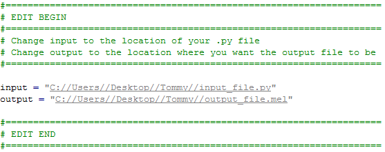

Contrary to what Autodesk states, you can actually use Python in Maya LT. If you'd like to quickly test it, make a new shelf icon and put this code in:

```
python("import maya.cmds as cmds\ncmds.polySphere()")
```

If you execute it, it'll create a new poly sphere in your scene; all done using Python! Using the python() function, MEL can execute Python code and is the basis for this post.

## Converting Python To Mel

Luckily, someone has written a tool that takes in Python code and converts it into a string that can be read by MEL. It was originally written by Jason Dixon and can be found on his site [here](http://internetimagery.com/python/py2mel.html). I've made a few minor changes to make it a bit more user-friendly. Grab the code [here](http://pastebin.com/eUxDAqxu) and put it into a file called **py2mel.py**.

Open the file in a text editor go to the section near the top with `EDIT BEGIN`. Change the input variable to the location of your .py file and change the output to where you'd like the new file to be. Make sure it's in quotes and all slashes are double forward slashes. Like below:



Make sure you have Python installed and then run **py2mel.py**. If all goes well, you'll have a new file containing your Python code as a string and passed into a python() function.

To use it, create a new shelf icon, go to the Command tab and then paste your converted code in. Easy peasy, lemon squeezy.

## Limitations

Using Python in Maya LT does come with limitations. From what I've tested, you can not use functions that are specific to Python. You'll need to use a MEL equivalent (if there is one). For example, you can't use Python's open() function, you have to use MEL's fopen(). So instead of using this:

```
fileObject = open(fileDirectory)
```

You use this:

```
fileObject = mel.eval("fopen('%s');" % fileDirectory)
```

It's not hard to do but it does make your code look a bit messier.